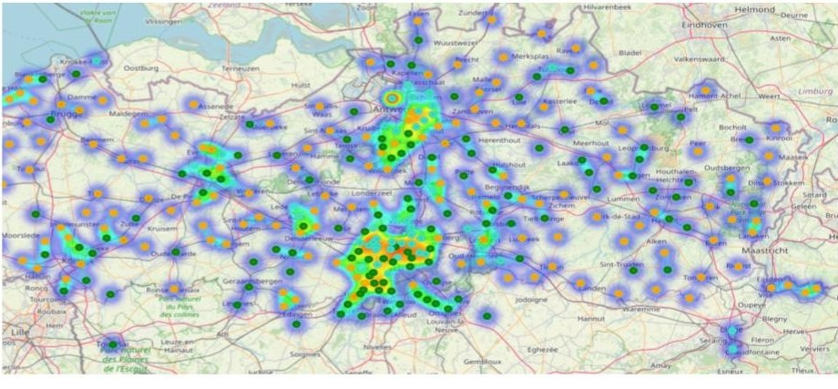
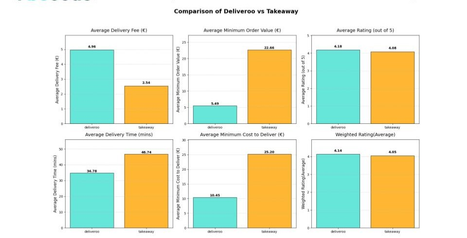

# Delivery Market Analysis With SQL


## 📝 Description  
The **Delivery Market Analysis** project dives into trends, customer preferences, and market dynamics in Belgium’s food delivery industry. 
It specifically analyzes the performance of three leading platforms: **TakeAway**, **UberEats**, and **Deliveroo**. Leveraging real-world databases, the analysis provides actionable insights for restaurant partners and consumers, ultimately improving user experience and guiding strategic decisions.

---

## 📊 Project Highlights  

- **Consumer Preferences**: Identifies the top-rated restaurants across various food categories, helping users make informed dining decisions.  
- **Platform Comparisons**: Evaluates the strengths and weaknesses of TakeAway, UberEats, and Deliveroo in terms of pricing, delivery fees, and the price-to-rating relationship.  
- **Regional Trends**: Explores regional patterns to identify service gaps and local food preferences across Belgium.  

This project offers a comprehensive overview of these platforms to enhance the food delivery experience for consumers while providing valuable insights for market stakeholders.

## 📦 Repo structure
```
├── DB Schemas
    ├── ER_schema_deliveroo.png
    ├── ER_schema_takeaway.png
    └── ER_schema_ubereats.png
└── databases
    ├── deliveroo.db
    ├── takeaway.db
    └── ubereats.db

├──deliveroo_take_away_comparison_final.ipynb 
├── KeyQuestions.ipynb
├── OpenEndedQuestions
├── README.md
├── Basma
├── Rik
├── Urson
├── Yeliz

```
## 📊 Visual Insights

### **Platform Comparisons and Insights**  

<table>
  <tr>
    <td align="center">
      
    </td>
    <td align="center">
      
    </td>
  </tr>
  <tr>
    <td align="center">
      
    </td>
    <td align="center">
      
    </td>
  </tr>
  <tr>
    <td align="center">
      
    </td>
    <td align="center">
      
    </td>
  </tr>
  <tr>
    <td align="center">
      
    </td>
  </tr>
</table>

---

#### For additional graphs and detailed insights, please visit our repository.

## ⏱️ Timeline
This project was done in 5 days including studying the theory and implementing the code.

## 📌 Context  
This project was developed as part of the **AI training program** at **BeCode Academy**, providing hands-on experience in SQL and data analysis.


## 🌐 Connect with Us!  

[](https://www.linkedin.com/in/basma-salem-ba45a1113)  
[]()  
[]()
[]()
