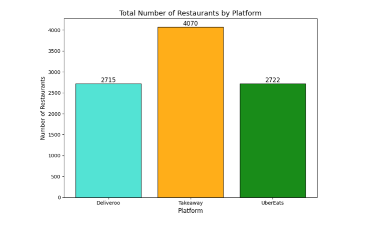

# Delivery Market Analysis With SQL


##  Description
The Delivery Market Analysis project focuses on exploring trends, customer preferences, and market dynamics within Belgium's food delivery industry, specifically analyzing three major platforms: TakeAway, UberEats, and Deliveroo. This analysis utilizes databases provided by a consultant to uncover actionable insights for restaurant partners and consumers, with the goal of improving user experiences and supporting strategic decision-making.

## 📊 Overview to the project
Access to meals has been revolutionized by platforms like TakeAway, UberEats, and Deliveroo, offering unparalleled convenience and diverse dining options. This project provides valuable insights into these platforms by analyzing:

**Consumer Preferences**: Highlighting the top-rated restaurants across key food categories on each platform to help users make informed dining choices.

**Platform Comparisons**: Assessing the strengths and weaknesses of TakeAway, UberEats, and Deliveroo, including pricing structures, delivery costs, and the relationship between price and ratings.

**Regional Trends**: Investigating patterns across cities and regions in Belgium to identify service gaps and local preferences for each platform.
By delivering a comprehensive overview of these platforms, this analysis aims to enhance the food delivery experience for users, helping them navigate the market more effectively while exploring the unique offerings of TakeAway, UberEats, and Deliveroo.
## 📦 Repo structure
```
├── DB Schemas
    ├── ER_schema_deliveroo.png
    ├── ER_schema_takeaway.png
    └── ER_schema_ubereats.png
└── databases
    ├── deliveroo.db
    ├── takeaway.db
    └── ubereats.db

├──deliveroo_take_away_comparison_final.ipynb 
├── KeyQuestions.ipynb
├── OpenEndedQuestions
├── README.md
├── Basma
├── Rik
├── Urson
├── Yeliz

```
## 📊 Visual Insights

### Total Number of Restaurants                   


### Geographical Coverage


### Distribution of Halal Restaurants


### 5. Deliveroo vs. TakeAway Comparison


### Low Price Buckets (<10€)


### High Price Buckets (20–30€)


### Premium Price Buckets (>30€)


#### For more Graghs and Details You can Visit our Repo

## ⏱️ Timeline
This project was done in 5 days including studying the theory and implementing the code.

## 📌  Situation
This project was done as part of our AI training program at BeCode.


### Connect with Us!
[](https://www.linkedin.com/in/basma-salem-ba45a1113)
